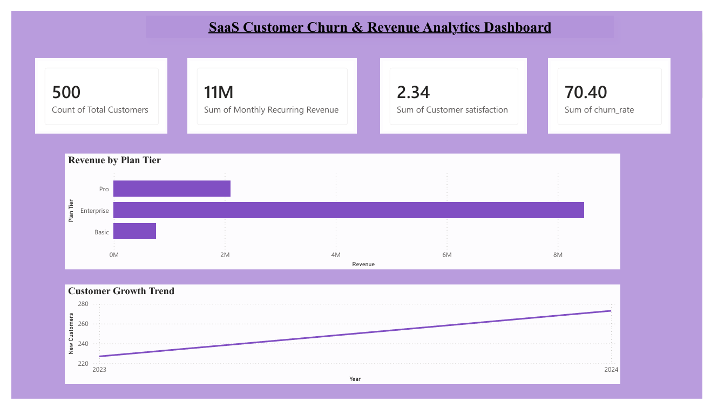
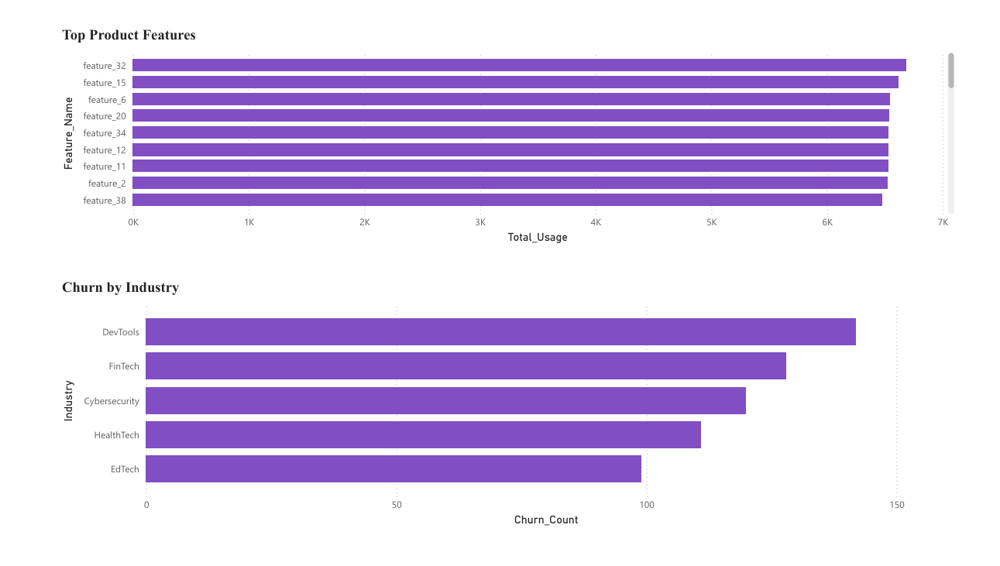
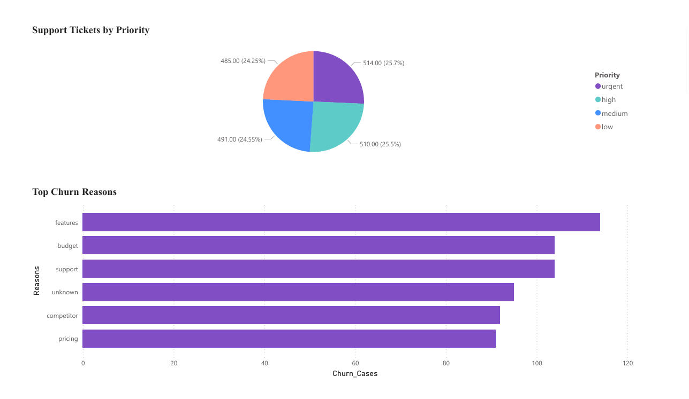

# SaaS Customer Churn & Revenue Analytics
Data analytics project exploring SaaS metrics including MRR, churn rate, feature adoption, and support insights using SQL and Power BI dashboards.
## Project Overview
This project analyzes SaaS platform data to understand customer growth, churn behavior, revenue trends, and product usage.

Tools Used:
- SQL
- Power BI
- Excel

## Dataset
The dataset includes:

accounts.csv – customer metadata  
subscriptions.csv – subscription lifecycle and revenue  
feature_usage.csv – product usage data  
support_tickets.csv – support interactions  
churn_events.csv – churn events and reasons

## Key Metrics
- Monthly Recurring Revenue (MRR)
- Customer Churn Rate
- Customer Growth
- Feature Adoption
- Support Ticket Distribution

## Dashboard

### Executive Overview

### Product Insights

### Churn Analysis

## Insights

• Enterprise plan generates the highest revenue  
• Feature adoption strongly correlates with retention  
• Most churn comes from SMB customers  
• Pricing and missing features are top churn drivers

## Project Structure
